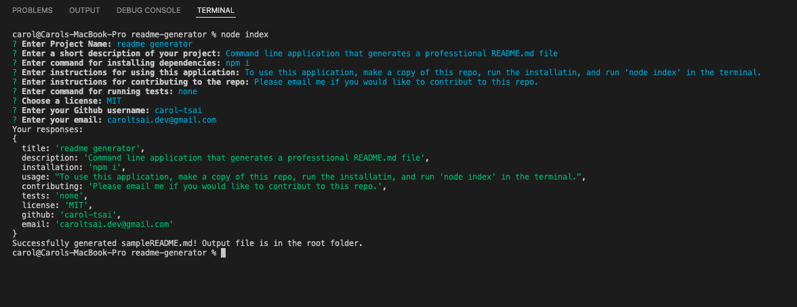

# Readme Generator

  

  ## Description
  This is a command line application that accepts user input and generates a high-quality, professional README file.

  ## Table of Contents
  - [Installation](#installation)
  - [Usage](#usage)
  - [License](#license)
  - [Contributing](#contributing)
  - [Questions](#questions)

  ## Installation
  To install dependences for this application, run the following command in terminal:

    npm i

  ## Usage
  
  To use this application, make a copy of this repo, run the installation, and run 'node index' in the terminal. 

  You will be prompted to enter information about your project and what you would like to include in your markdown file.

  
  
  A file called sampleREADME.md will be generated in the root folder. You can now move/rename this file as needed.

  ## License
  MIT License

Copyright (c) 2022 Carol Tsai

Permission is hereby granted, free of charge, to any person obtaining a copy
of this software and associated documentation files (the "Software"), to deal
in the Software without restriction, including without limitation the rights
to use, copy, modify, merge, publish, distribute, sublicense, and/or sell
copies of the Software, and to permit persons to whom the Software is
furnished to do so, subject to the following conditions:

The above copyright notice and this permission notice shall be included in all
copies or substantial portions of the Software.

THE SOFTWARE IS PROVIDED "AS IS", WITHOUT WARRANTY OF ANY KIND, EXPRESS OR
IMPLIED, INCLUDING BUT NOT LIMITED TO THE WARRANTIES OF MERCHANTABILITY,
FITNESS FOR A PARTICULAR PURPOSE AND NONINFRINGEMENT. IN NO EVENT SHALL THE
AUTHORS OR COPYRIGHT HOLDERS BE LIABLE FOR ANY CLAIM, DAMAGES OR OTHER
LIABILITY, WHETHER IN AN ACTION OF CONTRACT, TORT OR OTHERWISE, ARISING FROM,
OUT OF OR IN CONNECTION WITH THE SOFTWARE OR THE USE OR OTHER DEALINGS IN THE
SOFTWARE.

  ## Contributing
  Please email me if you would like to contribute to this repo.

  ## Questions
  Got questions? You can email me at caroltsai.dev@gmail.com or at my github: [carol-tsai](https://github.com/carol-tsai).
